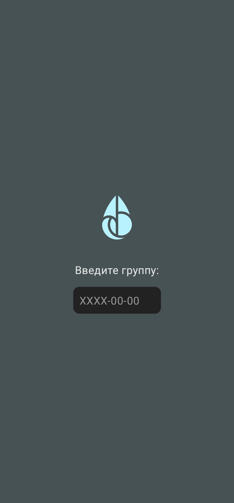
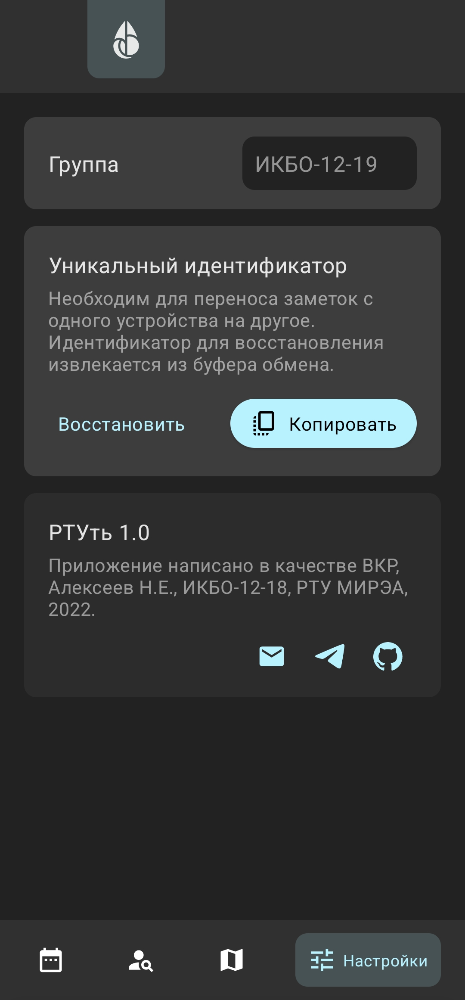
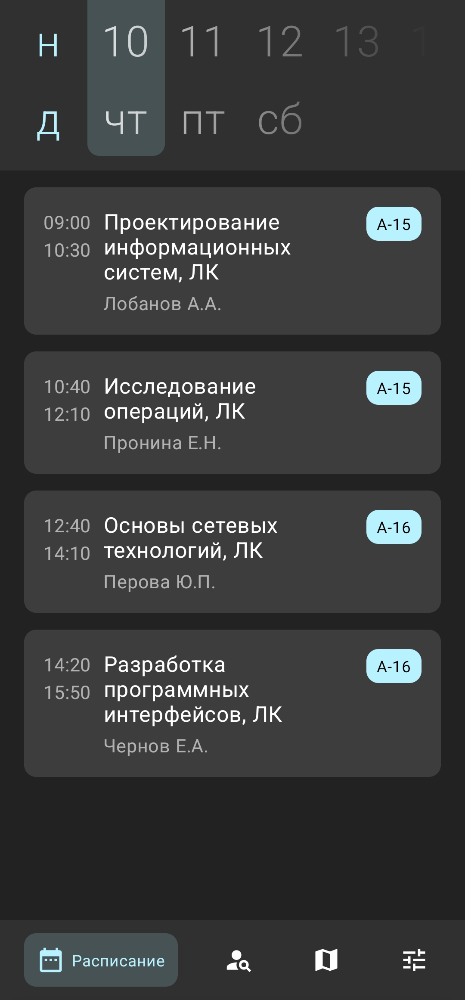
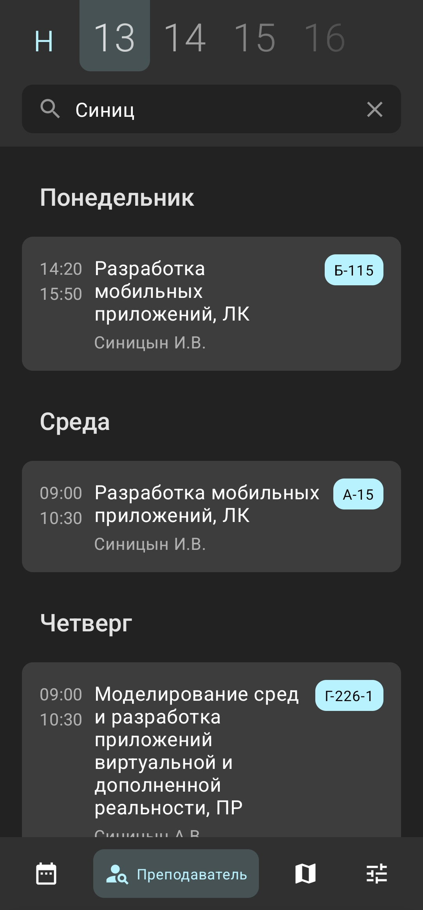
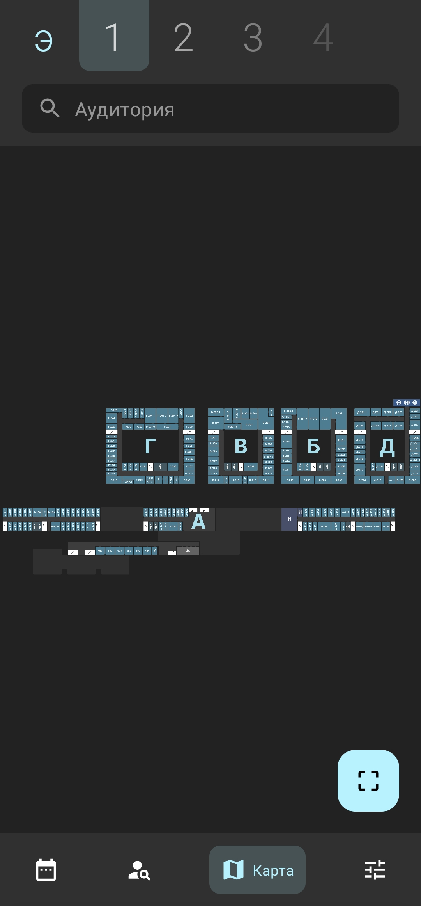
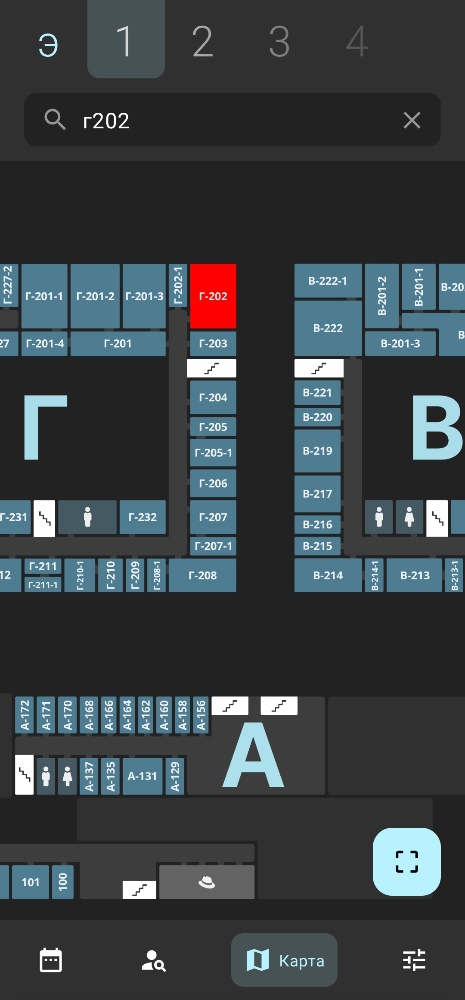

# RTUt

Client side of RTUt –– service for viewing the schedule, searching for audiences and writing notes for classes at RTU MIREA.

## Download
* [Download on GitHub](https://github.com/Neexol/RTUt-Android/releases)

## Building
* Clone repository:
    * `git clone https://github.com/Neexol/RTUt-Android.git`
* The project can be built with Android Studio 2021.2.1+

## How to start
By default, app use `https://rtut-mirea.herokuapp.com/` as server URL. If you want to use your own URL you need to provide as `BASE_URL` in [Constants](https://github.com/Neexol/RTUt-Android/blob/master/app/src/main/java/ru/neexol/rtut/core/Constants.kt) object.

## Translations
* English
* Russian

## RTUt is built with latest development tools and design patterns
* [Kotlin](https://kotlinlang.org/)
* [Flows](https://kotlinlang.org/docs/flow.html#sequences)
* [Coroutines](https://kotlinlang.org/docs/coroutines-overview.html)
* [Jetpack Compose](https://developer.android.com/jetpack/compose)
* [MVVM architecture](https://developer.android.com/topic/architecture)
* [Dependency injection](https://developer.android.com/training/dependency-injection)

## Third party libraries
* [retrofit2](https://square.github.io/retrofit/)
* [hilt](https://dagger.dev/hilt/)
* [kotlinx.serialization](https://github.com/Kotlin/kotlinx.serialization)
* [accompanist](https://github.com/google/accompanist)
* [androidsvg](https://bigbadaboom.github.io/androidsvg/)

## User interface
### Group choosing screens

  
  

### Schedule screens

  
  

### Map screen

  
  

### Notes screens

  
  

